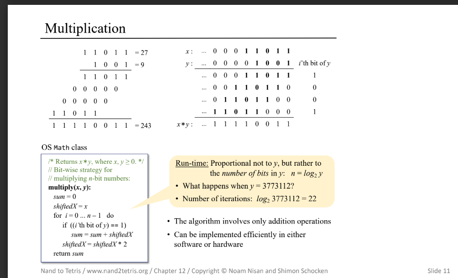
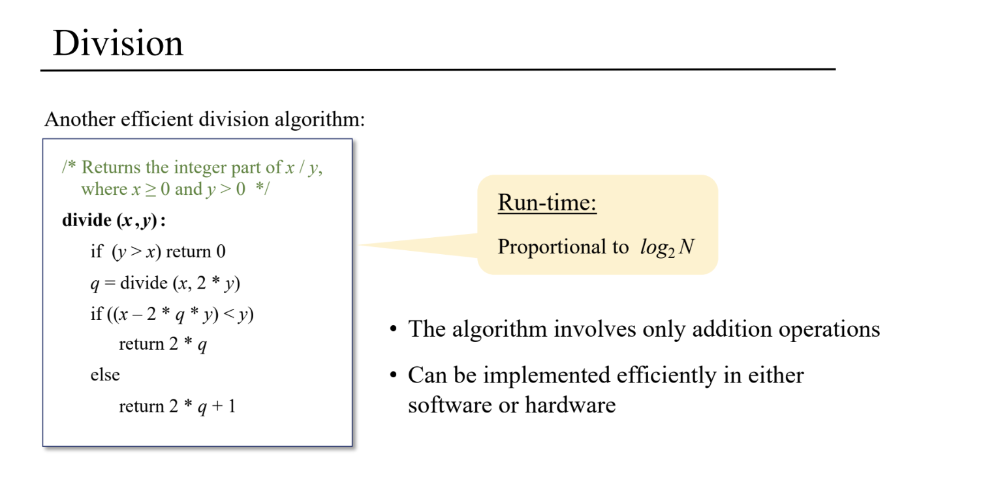
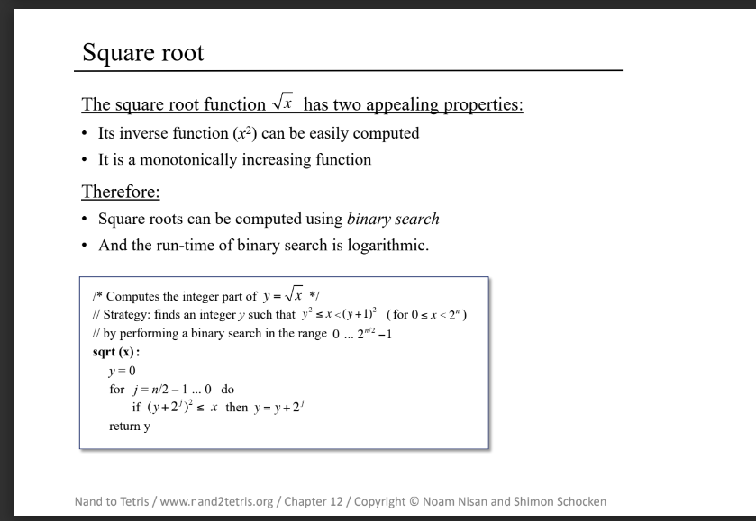
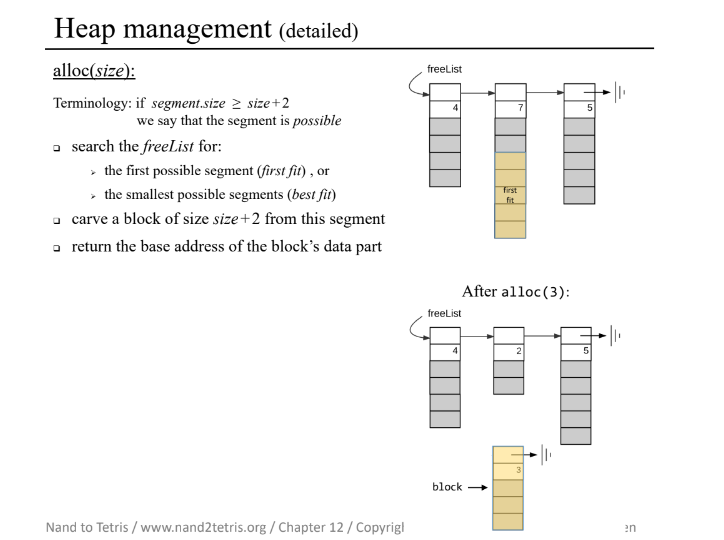

# 実装参照

https://github.com/AllenWrong/nand2tetris/tree/master/12

# OS機能 理解

Jackの標準ライブラリとしてOS機能を提供する

## この書籍で扱うOS機能

* [数学処理](./README.md#数学処理) `Math.jack`
* [メモリ管理](./README.md#メモリ処理) `Memory.jack`
* [配列型](./README.md/#配列型) `Array.jack`, `String.jack`
* [I/Oドライバ](./README.md#I/Oドライバ) `Keyboard.jack`, `Output.jack`, `Screen.jack`

## この書籍で扱わないOS機能

* マルチスレッド・コアCPU対応
* ファイルシステム
* Shell
* グラフィカルツール
* 通信機能 (TCP/IP、ドメインソケット)
* セキュリティ機能
* CPUの特権モード実行

## 数学処理

### 乗算 multiply

小学校でやる掛け算の筆算を乗算のアルゴリズムに適用させる。

以下の例図にて27✕9では9(1001)の並びを27(11011)の最左の1の位からシフトしながら順に足し算している。

前章までの乗算アルゴリズムは27✕9は27回のLoop処理(O(x)(指数関数的))であったが、27のビット数分(n=log2_27 → 5回)のLoop処理(O(n))になる。※

※ここで、O(n)のnは本章ではビット数を意味する。

このアルゴリズムならばハードウェア上にも実装できるし当然ソフトウェアでも実現ができる。

### 除算 divide

これも小学校でやる割り算の筆算をアルゴリズムに適用させる。

アルゴリズムには再帰処理を利用する。

`x÷y`をやりたいとき、yをxを越さないギリギリまでシフトさせて大きくした分から商を増加させて再帰処理をほどこす。

### 平方根

`√100` を求めたいとき`y^2 < 100 < (y+1)^2` であるyを見つければよい。

このとき、見つけ方として 0と2^n を初期値の両極端としたバイナリサーチにより求めることができる。

## メモリ処理

メモリ割り当てアルゴリズム

Linked Listのデータ構造を用いる。

1つのLinked Listのオブジェクトの先頭アドレスにはListのサイズ、2番目のアドレスには次のLinked Listのオブジェクトのアドレスが入る。

`segment.length==segment[0]`, `segment.next==segment[1]`

上記の2つの情報によってAlloc(size)で指定されたsizeを満たすメモリ割り当てができるListの探索をする。

Allocationは以下の図のようにFreeであるListを探索後に対象Listから切り離す形で割当メモリとして扱うことを示す。

De-allocationの際は対象のブロックをLinked Listに追加するようにする。

このとき、フラグメンテーションが発生するのでどこかのタイミングでデフラグメンテーションを実行する必要がある。

## 配列型

Stringオブジェクトは実態はメモリ配列である。

数値を文字列にする処理は文字コードにしたがって演算をするだけである。

## I/Oドライバ

I/Oドライバの実態はメモリマップである。そのため、対象のメモリ位置の読み込み/書き込みをすることでI/Oの読み込み/書き込みが実現される。

screenのベースアドレスは本書のコンピュータでは16384であるので`screen[x..y]=1`のような書き込みによってスクリーンに描写される。
